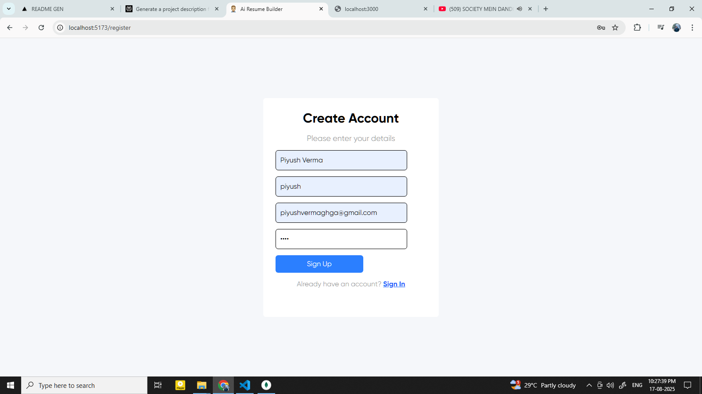
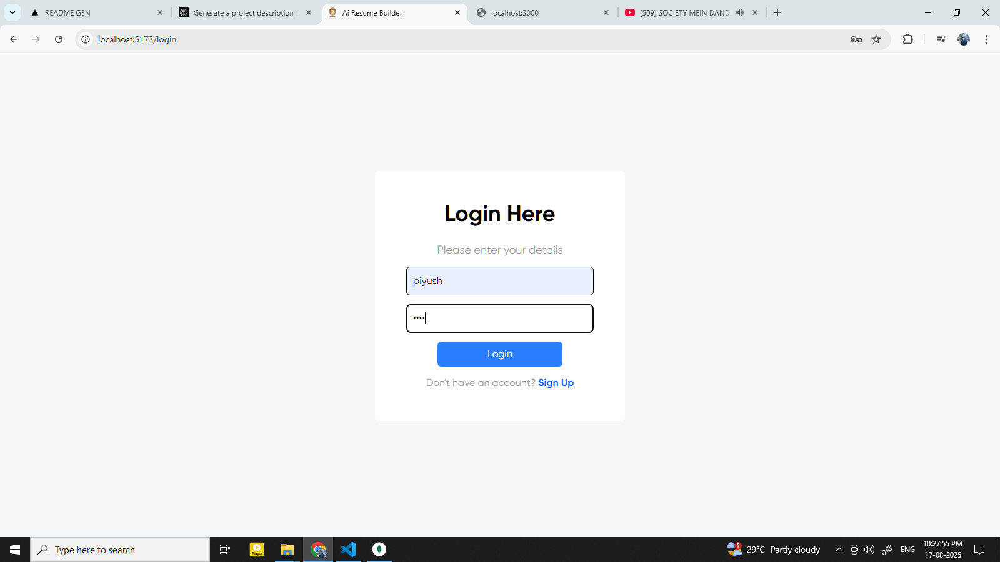
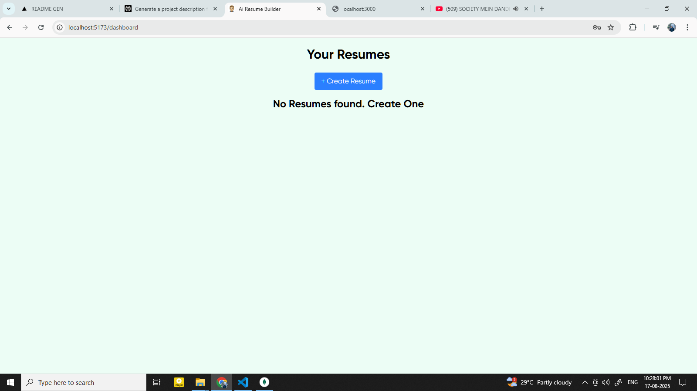
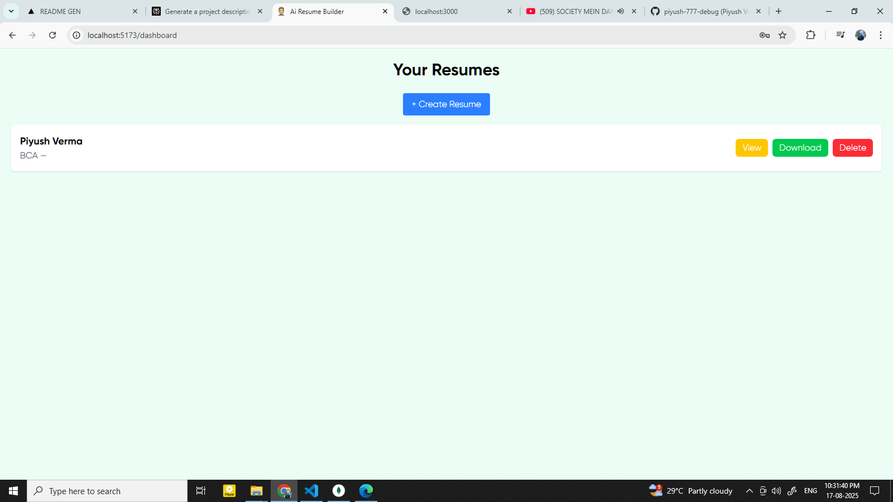
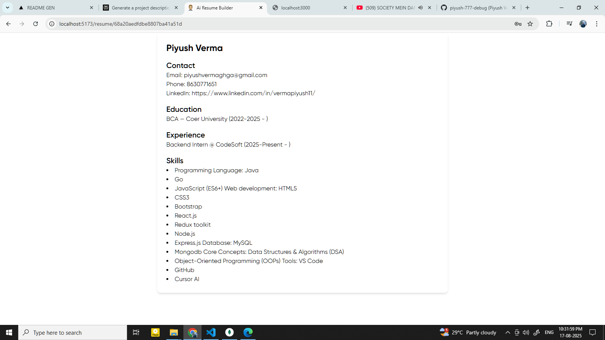

# <h1 align="center" id="title">AI Resume Builder</h1>

<p align="center">
AI Resume Builder is a smart web app that helps users create professional resumes in minutes. Just fill in your details and the app will generate a polished, job-ready resume that you can preview and download.
</p>

<p align="center">
  
  
  
  
</p>

---


<h2>🖼️ Project Screenshots:</h2>





<details>
<summary>🧐 Features</summary>

- 🔹 Easy form to collect user details (education, experience, skills, etc.)  
- 🔹 AI-powered suggestions to improve resume content  
- 🔹 Download resumes in PDF format  
- 🔹 Generate cover letters or tailored resumes for specific jobs  

</details>

<details>
<summary>💻 Built With</summary>
-React.js – Frontend framework

-Node.js – Backend runtime

-MongoDB – Database

-Google Gemini API – AI-powered suggestions

</details>

<summary>🛠️ Installation Steps</summary>
1. **Clone the repository**

```bash
git clone https://github.com/piyush-777-debug/ai-resume-builder.git

2. Change directory
cd ai-resume-builder

3.Install Node packages
npm install

4.Run the development server
npm run dev
